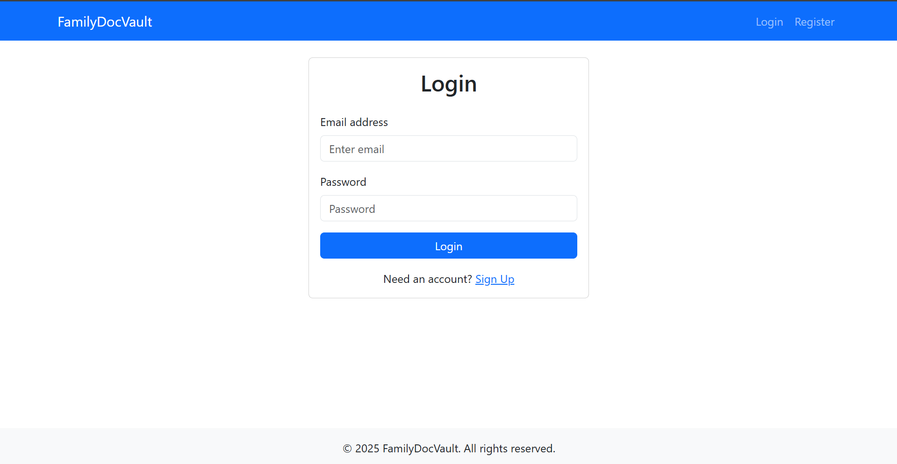
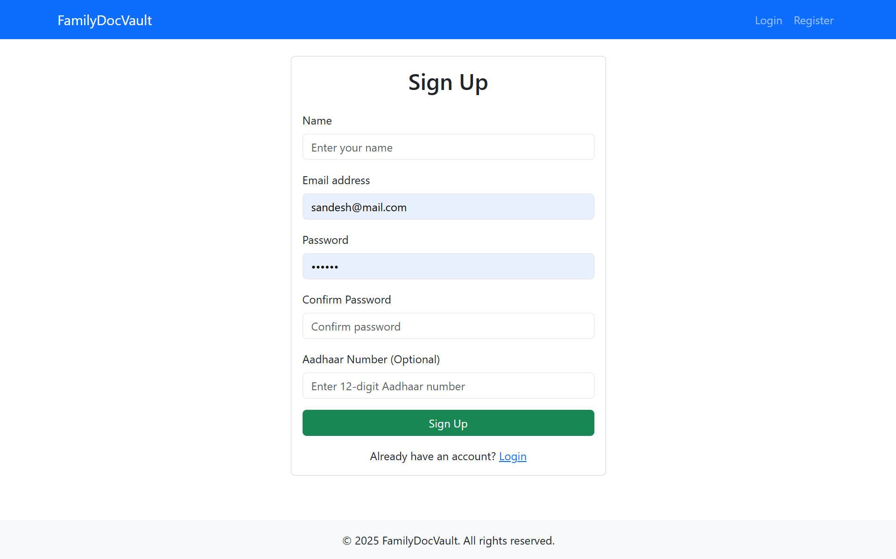
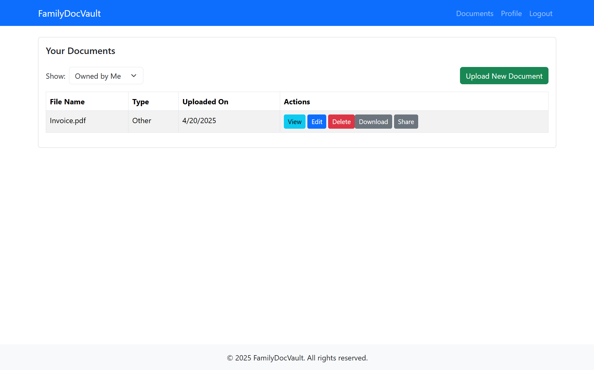
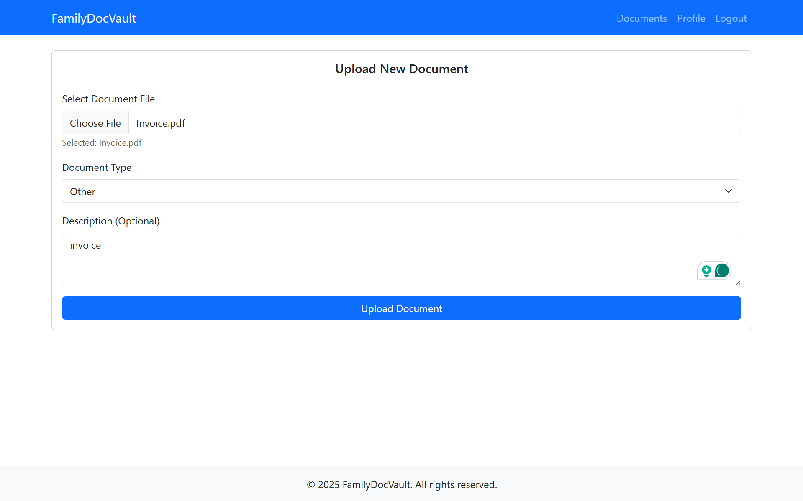
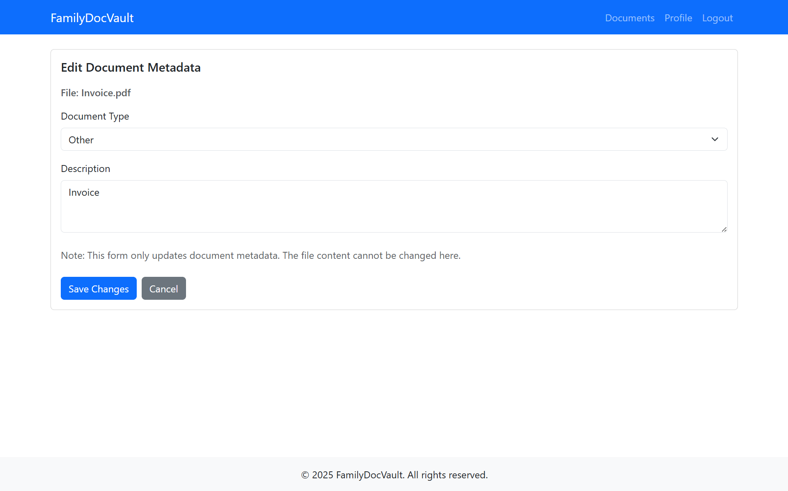
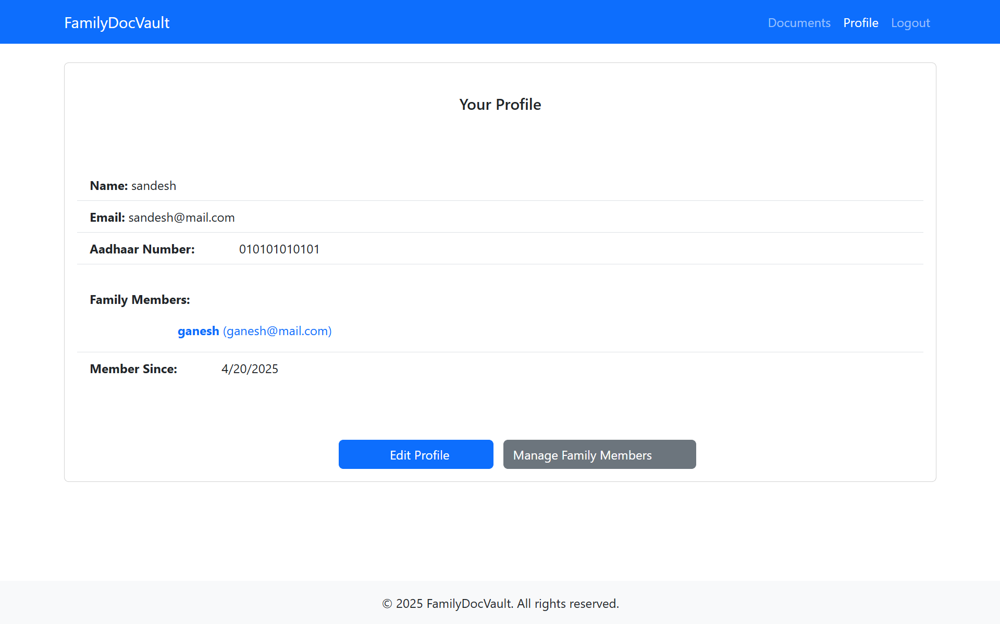
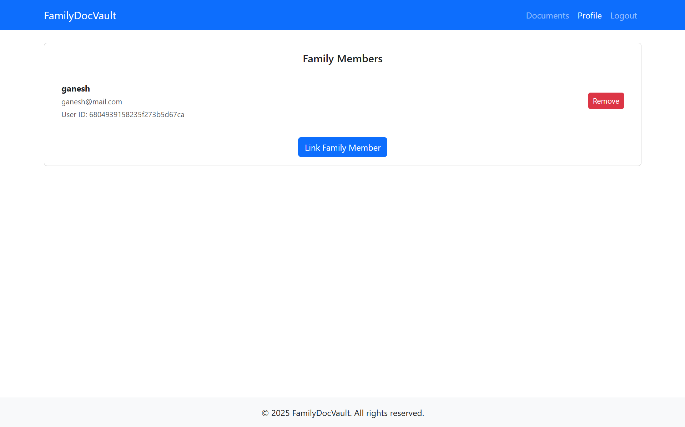
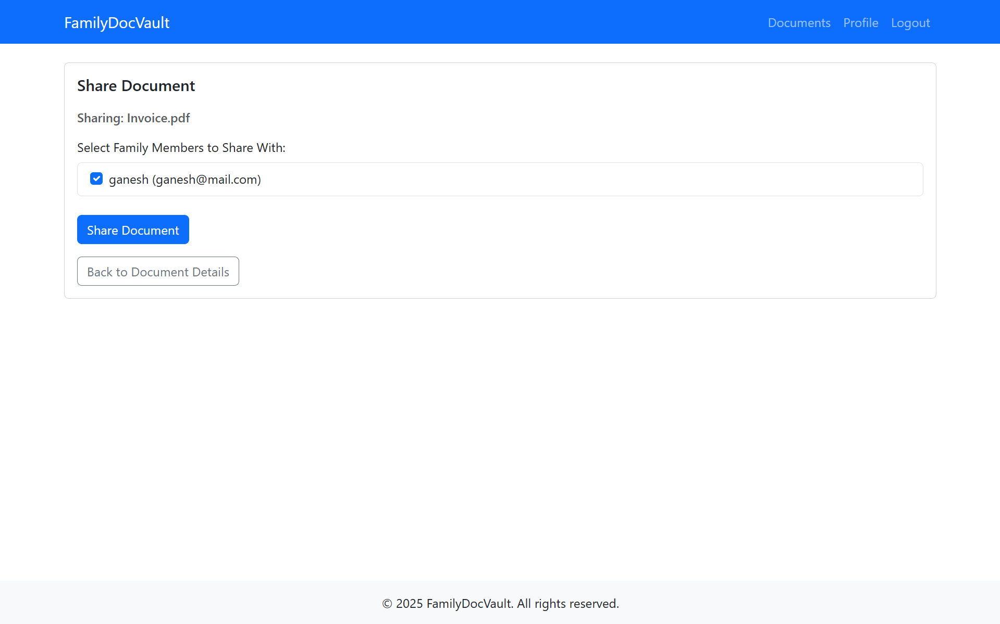

# FamilyDocVault

A secure web application built with the MERN stack (MongoDB, Express.js, React, Node.js) for storing, managing, and sharing important family documents within a trusted network. It emphasizes secure storage, controlled access, and a user‑friendly interface for handling sensitive personal and family records.

## ✨ Features

- **User Authentication:** Robust registration and login system using JWT.
- **Profile Management:** View and update personal information; manage linked family members.
- **Family Member Linking:** Securely connect with other registered users via email or Aadhaar number.
- **Document Upload:** Upload images, PDFs, and other file types securely.
- **Document Management:**
  - Browse all your documents
  - Filter by “Owned” or “Shared”
  - View details and perform actions (edit, delete, download)
- **Search & Filtering:** Find documents by filename, type, or description.
- **Document Metadata Editing:** Update the type and description of documents you own.
- **Document Sharing:** Share specific documents with selected linked family members.
- **Access Control:** Backend authorization ensures users can only access, modify, or share documents based on ownership or explicit permissions.
- **Document Download & Deletion:** Download any document you own or that’s shared with you; delete your own documents.

## 📸 Screenshots

> _(Replace these placeholders with actual screenshots of your application)_

- **Login Page:**  
  

- **Register Page:**  
  

- **Document List Page:**  
  

- **Document Upload Page:**  
  

- **Document Edit Page:**  
  

- **Profile View Page:**  
  

- **Manage Family Members:**  
  
  

## 🛠️ Technologies Used

**Backend**

- **Node.js & Express.js:** Server runtime and web framework
- **MongoDB & Mongoose:** Database and ODM for data persistence
- **JWT (jsonwebtoken):** Token‑based authentication
- **bcryptjs:** Password hashing
- **Multer:** Handling multipart/form‑data for file uploads
- **Winston:** Server‑side logging
- **Nodemon:** Automatic server restarts during development

**Frontend (Vite + React)**

- **React:** Component‑based UI library
- **Vite:** Fast build tool
- **React Router DOM:** Client‑side routing
- **Axios:** HTTP client for API calls
- **Bootstrap & React‑Bootstrap:** Pre‑built UI components & responsive design
- **jwt-decode:** Decode JWTs client‑side

## 📁 Project Structure

```
family-doc-vault/
│
├── README.md           # Project overview and setup instructions
├── .gitignore          # Specifies untracked files to ignore
│
├── backend/            # Node.js & Express backend
│   ├── .env            # Environment variables (ignored by Git)
│   ├── package.json    # Backend dependencies and scripts
│   ├── server.js       # Main server file
│   ├── config/         # Database connection setup
│   │   └── db.js
│   ├── controllers/    # Route handlers
│   │   ├── authController.js
│   │   ├── documentController.js
│   │   └── userController.js
│   ├── middleware/     # Custom Express middleware
│   │   ├── asyncHandler.js
│   │   ├── authMiddleware.js
│   │   └── errorHandler.js
│   ├── models/         # Mongoose schemas
│   │   ├── Document.js
│   │   └── User.js
│   ├── routes/         # API routes
│   │   ├── auth.js
│   │   ├── documents.js
│   │   └── users.js
│   ├── uploads/        # Uploaded files (Git‑ignored)
│   └── utils/          # Utility functions
│       ├── errorResponse.js
│       └── logger.js
│
└── frontend-vite/      # React frontend (Vite)
    ├── .env            # Frontend environment variables
    ├── package.json    # Frontend dependencies and scripts
    ├── vite.config.js  # Vite configuration
    ├── index.html      # HTML entry point
    ├── src/            # Source code
    │   ├── main.jsx        # App entry point
    │   ├── App.jsx         # Main App component
    │   ├── routes.jsx      # React Router setup
    │   ├── assets/         # Static assets
    │   ├── components/     # Reusable UI components
    │   ├── context/        # React Context providers
    │   ├── hooks/          # Custom hooks
    │   └── services/       # API service functions
    └── public/         # Static files copied to build
```

## 🚀 Getting Started

### Prerequisites

- **Node.js** (v14 or later) & **npm** (v6 or later)
- **MongoDB** instance (local or cloud)
- **Git**

### 1. Clone the Repository

```bash
git clone https://github.com/Sandesh-projects/family-doc-vault
cd family-doc-vault
```

### 2. Backend Setup

```bash
cd backend
npm install
```

Create a `.env` file in `backend/`:

```
NODE_ENV=development
PORT=5000
MONGO_URI=mongodb://localhost:27017/familydocvault
JWT_SECRET=your_strong_random_secret
JWT_EXPIRE=30d
```

Initialize the uploads directory:

```bash
mkdir uploads
```

This can be updated with server storage

### 3. Frontend Setup

```bash
cd ../frontend-vite
npm install
```

Create a `.env` file in `frontend-vite/`:

```
VITE_REACT_APP_API_URL=http://localhost:5000
```

### 4. Run the Project

#### Start Backend

```bash
cd backend
nodemon server.js
```

#### Start Frontend

```bash
cd ../frontend-vite
npm run dev
```

Open your browser and navigate to the URL displayed by Vite (e.g., `http://localhost:5173`).

## ▶️ Usage

Once the app is running, you can:

1. **Register** a new account or **Log in**.
2. **Upload** and **manage** your family documents.
3. **Link** with family members and **share** documents securely.
4. **Search**, **filter**, **download**, **edit**, or **delete** documents as needed.

## 🌱 Potential Future Enhancements

- Implement role‑based access control within families.
- Add document versioning and audit history.
- Include real‑time notifications for shared documents.
- Enhance UI/UX with better loading states and form validation.
- Refactor frontend into TypeScript and modularize services.
- Add unit & integration tests with Jest and Cypress.
- Set up CI/CD pipelines for automated testing and deployment.

---
